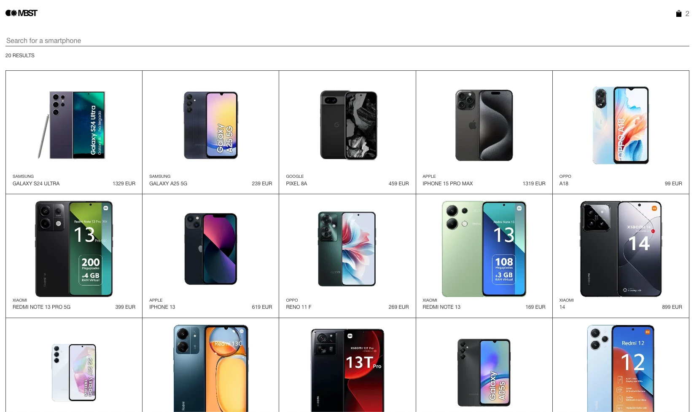
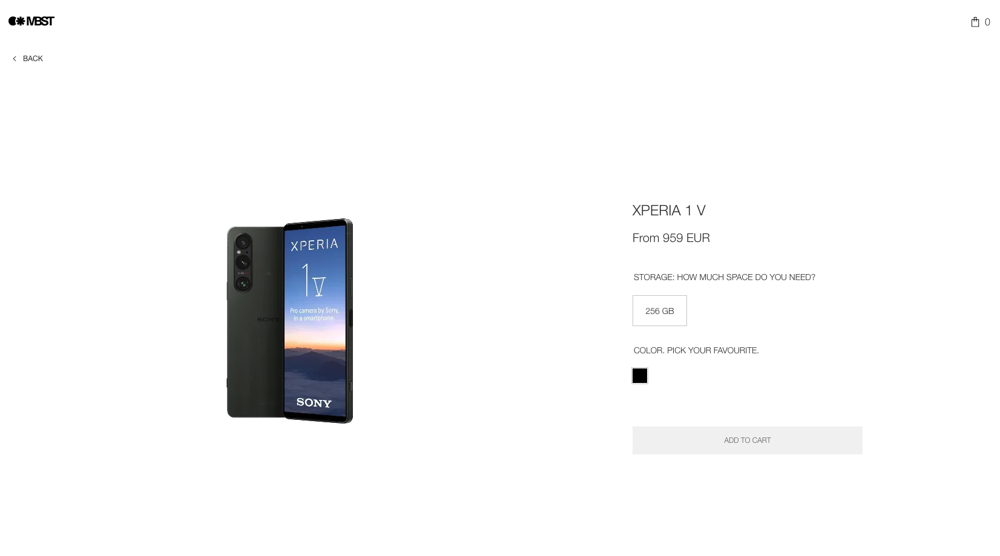
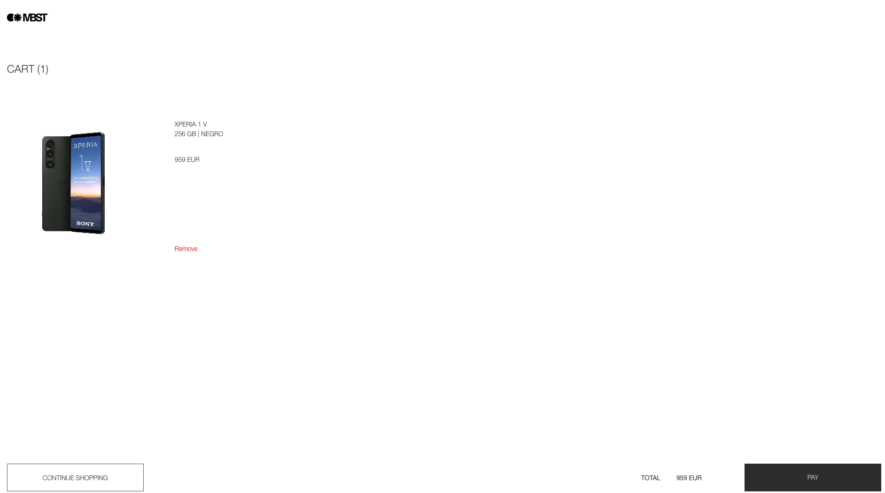

# Zara Web Challenge

Responsive smartphone catalog built for the Napptilus frontend technical
challenge. The application lets users search the catalog, inspect and configure
a product, browse similar items, and manage a persistent shopping cart.

**Live demo:** <https://amarcet-napptilus-challenge.netlify.app/>



| Product detail                                                      | Cart                                                |
| ------------------------------------------------------------------- | --------------------------------------------------- |
|  |  |

## Features

- Product catalog limited to 20 results, with server-side search and a result
  counter.
- Product detail with storage and color selection, dynamic pricing,
  specifications, and similar products.
- Persistent cart with independent lines for every configured product.
- Responsive layouts for mobile, tablet, desktop, and wide desktop viewports.
- Loading, empty, error, and not-found states.
- Accessible navigation, form labels, status messages, and keyboard focus
  styles.
- Client-side image processing to remove connected white backgrounds and
  normalize product artwork.

## Technology

| Area       | Choice                                                           |
| ---------- | ---------------------------------------------------------------- |
| Build tool | Vite 6                                                           |
| UI         | React 19                                                         |
| Routing    | React Router 7                                                   |
| Styling    | styled-components, CSS custom properties, and shared breakpoints |
| State      | React Context and local component state                          |
| Data       | Native `fetch` API                                               |
| Tests      | Vitest, jsdom, and React Testing Library                         |
| E2E        | Playwright                                                       |
| Quality    | ESLint and Prettier                                              |

## Getting started

### Requirements

- Node.js 24 (see `.nvmrc`)
- npm 10 or newer
- An API key for the challenge API

### Installation

```bash
git clone git@github.com:adriamarcet/zara-web-challenge-amarcet.git
cd zara-web-challenge-amarcet
npm ci
cp .env.example .env.local
```

Add the API key to `.env.local`:

```env
VITE_X_API_KEY=your_api_key
```

Start the development server:

```bash
npm run dev
```

Open [http://localhost:5173](http://localhost:5173).

All requests to the products API include the key in the `x-api-key` header.
Variables prefixed with `VITE_` are embedded in the browser bundle, so this key
must not be treated as a server-side secret. A production system that requires a
private credential should place the API call behind a backend or serverless
proxy.

## Available scripts

| Command                | Purpose                                 |
| ---------------------- | --------------------------------------- |
| `npm run dev`          | Start the Vite development server       |
| `npm run build`        | Create the production build in `dist/`  |
| `npm run preview`      | Serve the production build locally      |
| `npm test`             | Run Vitest in watch mode                |
| `npm test -- --run`    | Run the test suite once                 |
| `npm run lint`         | Check the code with ESLint              |
| `npm run format`       | Format the repository with Prettier     |
| `npm run format:check` | Check formatting without changing files |
| `npm run test:e2e`     | Run the Playwright end-to-end tests     |
| `npm run test:e2e:ui`  | Run the Playwright tests in UI mode     |

**Development and production modes:** `npm run dev` serves the assets unminified
with hot reload, while `npm run build` produces concatenated, minified and
hashed assets in `dist/` (`npm run preview` serves them locally).

For a complete local verification:

```bash
npm run lint
npm run format:check
npm test -- --run
npm run build
npm run test:e2e
```

## Application routes

| Route                  | Description                                              |
| ---------------------- | -------------------------------------------------------- |
| `/`                    | Product catalog and debounced search                     |
| `/products/:productId` | Product configuration, specifications, and similar items |
| `/cart`                | Persistent cart, total, and item removal                 |
| `*`                    | Not-found page                                           |

## Architecture

The source follows a feature-first structure based on pragmatic vertical
slices. Product and cart code are organized around business capabilities,
while application composition and genuinely reusable infrastructure remain
outside those features.

```text
src/
|-- app/
|   |-- main.jsx                         Browser entry point and global provider
|   |-- App.jsx                          Routes and route-scoped providers
|   |-- layout/
|   |   |-- PageLayout.jsx               Shared route layout
|   |   `-- Header/                      Application header and styles
|   `-- routes/
|       `-- NotFoundPage.jsx             Fallback route
|-- features/
|   |-- products/
|   |   |-- api/                         Store API client and tests
|   |   |-- model/                       Catalog context, provider, and hook
|   |   |-- catalog/                     Search and product-list flow
|   |   |-- detail/                      Product configuration and detail flow
|   |   `-- components/                  Product UI shared inside the feature
|   `-- cart/
|       |-- model/                       Cart context, persistence, and hook
|       |-- CartPage.jsx                 Cart route
|       |-- CartItem/                    Configured cart line
|       |-- CartSummary/                 Price summary and checkout action
|       `-- ContinueShopping/            Navigation back to the catalog
`-- shared/
    |-- assets/                          Brand and cart icons
    |-- lib/                             Framework-independent helpers
    `-- styles/                          Reset, tokens, utilities, and breakpoints
```

This is intentionally a lightweight interpretation of vertical slicing rather
than a strict implementation of a formal architecture. Each feature owns the
UI, state, and external boundaries needed by its workflows, but the project
does not add extra layers or public barrel files where its size does not justify
them.

### Folder responsibilities

- `app` is the composition root. It mounts global and route-scoped providers,
  declares routes, and contains layout that belongs to the whole application.
- `features/products` owns product retrieval and the catalog and detail user
  journeys. `catalog` and `detail` contain flow-specific UI, while `components`
  contains product presentation reused by more than one flow.
- `features/cart` owns cart state, `localStorage` persistence, and the complete
  cart screen. Its page and small UI groups remain at the feature root to avoid
  unnecessary nesting.
- `shared` contains only cross-feature resources with no business workflow of
  their own: static assets, generic helpers, global CSS, design tokens, and
  responsive breakpoints.

Component tests and `*.styles.js` modules are colocated with the code they
exercise. Service, provider, and shared utility tests follow the same rule. The
repository does not use a separate global `tests` directory.

Dependencies generally point from `app` to `features`, and from `features` to
`shared`. A small number of direct feature-to-feature imports represent real
workflow relationships: product detail adds configured items through the cart
model, and cart items reuse the product image component.

### Data flow

```text
main.jsx -> CartProvider -> App routes

Catalog route -> ProductsProvider -> productsService -> Store API
Detail UI  -> useProductDetail -> productsService -> Store API
Detail UI  -> CartProvider -> localStorage
Cart UI    -> CartProvider -> localStorage
```

- `productsService` owns the API base URL, query parameters, error handling,
  deduplication, and `x-api-key` header.
- The API returns a duplicated record (`XMI-RN13P5G`, Redmi Note 13 Pro 5G) in
  its 24-item catalog, so `limit=20` alone would yield only 19 unique products.
  `productsService` requests twice the limit, deduplicates by `id`, and keeps the
  first 20, so the catalog always shows 20 distinct phones.
- `ProductsProvider` is mounted only by the catalog route. It fetches the
  catalog and exposes loading, error, products, and search state.
- `useProductDetail` manages product loading, errors, and request cancellation.
  `ProductDetail` keeps its selected color and storage local to the screen.
- `CartProvider` validates stored data, calculates totals, and persists each
  configured product as an independent line.

## Technical decisions

The decisions below are the summary. A chronological log of choices and doubts
made while building the challenge (written in Spanish) is kept in
[decisiones.md](decisiones.md).

### Vite and client-side routing

The challenge is a client-rendered application without server-rendering or
backend requirements. Vite keeps development and production builds simple,
while React Router provides explicit catalog, detail, cart, and fallback routes.

### Node version

The brief mentions Node 18, which has been end-of-life since April 2025, and
current Vitest, jsdom, React Router, and Playwright require Node 20 or newer.
The project targets Node 24 (LTS) for development and CI. Node is only needed
to build: the output is static, so the deployment server does not run Node.

### Interface language

All user-facing text and accessible labels are in English. The brief names some
actions in Spanish ("Añadir al carrito", "Continuar comprando"), but the Figma
designs are written in English, so the interface follows the designs.

### State management

React Context is used only for state shared by multiple components. The cart
provider remains application-wide, while the products provider is scoped to
the catalog route. Their contexts, providers, and consumer hooks live in each
feature's `model` directory. Product configuration remains local to the detail
page. This avoids an additional state library for a deliberately small state
model.

### Search and request lifecycle

Search is sent to the API after a 250 ms debounce instead of filtering only the
currently loaded results. Requests use `AbortController`, preventing obsolete
responses from updating state after a new search or route change.

### Cart persistence

The cart is stored in `localStorage`. Stored entries are validated before use,
and storage failures fall back to an in-memory cart. Every add operation creates
a unique line, so repeated products and different configurations can be removed
independently.

### Styling and responsive behavior

Visual components keep their styled-components definitions in colocated
`*.styles.js` files. Global tokens, reset rules, utilities, and responsive
breakpoints live under `src/shared/styles` and are loaded by the application
entry point. The catalog progresses from one column on mobile to three on
tablet and five once the viewport can support wide product cards.

The font stack is `'Helvetica Neue', Helvetica, Arial, sans-serif`. The brief
asks for `Helvetica, Arial, sans-serif`; `Helvetica Neue` is added first because
the Figma designs use it and plain Helvetica renders slightly off on macOS with
Firefox. Every other system falls back to the requested stack.

### Product images

Remote image URLs are normalized to HTTPS. Once an image loads, background
processing uses Canvas during browser idle time to remove white pixels connected
to the image edges and encode a centered WebP result. Canvas dimensions follow
the rendered image size, generated object URLs are revoked with their component
lifecycle, and failures fall back to the original image.

### JavaScript scope

The implementation uses JavaScript because TypeScript was not required and the
application has a small, well-tested data surface. API and storage boundaries
are still isolated so runtime validation or static typing could be introduced
without restructuring the UI.

## Testing

The test suite covers the API service, providers, catalog states, product cards,
image processing, product configuration, specifications, similar items, and the
cart flow.

```bash
npm test -- --run
```

Tests that render React components use jsdom and React Testing Library. Service
tests mock `fetch`, while provider and component tests exercise observable user
behavior and persistence boundaries. Every test is colocated with its source
module inside the corresponding application, feature, or shared directory.

## End-to-end tests with Playwright

The suite covers catalog and header navigation, product configuration, cart
presentation, empty states, item removal, and independent duplicate lines.
Cart persistence tests add articles through the configurator and verify
restoration after reload and in a new tab of the same browser context.
They check names, variants, rendered images, unit prices, counts, and totals
without seeding localStorage. Removed articles stay absent after reload, and
removing the last article leaves the cart empty after reload.
Loading tests hold API responses until the loading state is checked, then
release them to verify the content appears. Recovery tests cover server and
network failures, nonexistent products, and unknown routes. Catalog recovery
uses the logo after the API recovers; product and route failures use their
return-to-catalog links.
Mobile tests use a 390 × 844 viewport and touch input to search, configure,
add, remove, and return to shopping, checking for horizontal overflow.
Keyboard tests run at desktop and mobile widths and use actual Tab navigation,
Shift+Tab, typing, Space, arrow keys, and Enter without assigning focus or clicking.
They also check visible focus indicators on product links and option labels.
These are browser-based viewport and input simulations, not physical-device
tests. The shared catalog fixture filters search responses by product name
and brand.
API and image responses are intercepted for deterministic results; the real
application UI, routing, and cart persistence run in a real browser.
The saved configuration runs Chromium. Firefox was also used to validate the
suite through a temporary configuration.

Group tests by feature and context with a single `test.describe('Feature: …')`.
Use short, behavior-focused test titles rather than Given/When/Then titles or
nested BDD groups. Each test checks one behavior; related assertions can stay
together when they describe the same outcome.

Prepare shared context with `test.beforeEach()` using real UI actions. Every
test gets an isolated browser context and its own cart, and must pass when run
on its own. Keep reusable UI actions and assertions in `e2e/helpers/` and
controlled API/image fixtures in `e2e/fixtures/`. These conventions apply to
all existing and future e2e tests.
API and image fixtures are registered on the browser context so they also
apply to tabs opened during a test.

```bash
npx playwright install chromium
npm run test:e2e
```

Playwright starts the local Vite server automatically on port 5173. That port
must be available. For interactive execution, use `npm run test:e2e:ui`.
Failed tests retain a trace and screenshot in `test-results/`.
Vitest excludes `e2e/`, so `npm test` continues to run the unit/component suite.

## Deployment

This project builds to static assets and can be deployed to Vercel, Netlify,
Cloudflare Pages, or any static host.

Use the following build settings:

| Setting              | Value            |
| -------------------- | ---------------- |
| Install command      | `npm ci`         |
| Build command        | `npm run build`  |
| Output directory     | `dist`           |
| Environment variable | `VITE_X_API_KEY` |

Because the application uses `BrowserRouter`, the host must rewrite unknown
paths such as `/products/:productId` and `/cart` to `/index.html`. The included
`netlify.toml` already sets the build command, output directory, Node 24 and
this rewrite, so on Netlify only `VITE_X_API_KEY` needs to be added in the site's
environment variables. On other hosts, configure the same rewrite manually.
Verify the production output locally with:

```bash
npm run build
npm run preview
```

## Author

Developed by **Adrià Marcet**, frontend developer. Explore more of my work on
[GitHub](https://github.com/adriamarcet) or contact me at
[adriamarcetrovira@gmail.com](mailto:adriamarcetrovira@gmail.com).
